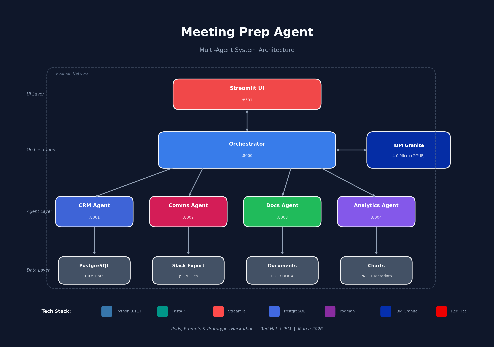

# Meeting Prep Agent


**Multi-agent system that generates pre-call briefings from CRM, Slack, documents, and analytics.**

Built for the *Pods, Prompts & Prototypes* hackathon (Red Hat + IBM) - Advanced tier: Multi-Agent Orchestration.

---

## The Problem

Senior reps get pulled into client calls at the last minute. They juggle multiple accounts and scramble through CRM, Slack, shared drives, and dashboards trying to piece together context. This takes 15-30 minutes before a 30-minute call.

## The Solution

Enter client name → Get a complete briefing in seconds.

Meeting Prep Agent is a multi-agent system that:
1. Queries your CRM (PostgreSQL) for client info, deals, and activities
2. Parses Slack conversations for recent context and action items
3. Reads proposals and meeting notes (PDF/DOCX via Docling)
4. Pulls analytics charts and metrics
5. Synthesizes everything into a scannable briefing

**Output:** A structured markdown briefing with deal status, stakeholders, open items, talking points, and analytics snapshot.

---

## Architecture



**All containers communicate over a Podman network. The LLM runs in Podman AI Lab on the host.**

---

## Quick Start

### Prerequisites

- Podman Desktop with Podman AI Lab extension
- IBM Granite 4.0 Micro model running in Podman AI Lab
- Node.js (for generating sample DOCX)
- Python 3.11+ (for generating sample charts)

### 1. Start the LLM

In Podman AI Lab:
1. Download `ibm-granite/granite-4.0-micro-GGUF`
2. Start the model server (note the assigned port)
3. Verify: `curl http://localhost:<PORT>/v1/models`

### 2. Generate Sample Data (Optional)

The demo data is pre-configured, but you can regenerate:

```bash
# Generate analytics charts (requires matplotlib)
cd data/scripts
pip install matplotlib numpy
python generate_charts.py

# Generate proposal PDF (requires reportlab)
pip install reportlab
python generate_proposal_pdf.py

# Generate meeting notes DOCX (requires docx)
npm install -g docx
node generate_meeting_notes.js
```

### 3. Start All Services

```bash
cd meeting-prep-agent
podman-compose up --build
```

Services will start:
- PostgreSQL (port 5432) - with CRM data auto-loaded
- CRM Agent (port 8001)
- Comms Agent (port 8002)
- Docs Agent (port 8003)
- Analytics Agent (port 8004)
- Orchestrator (port 8000)
- UI (port 8501)

### 4. Open the UI

Navigate to http://localhost:8501

Enter:
- Client: `Acme Corp`
- Topic: `Q1 Review`

Click "Generate Briefing" and watch the magic happen.

---

## Demo Scenario

**Setup:** Sarah Chen (Account Executive) has a Q1 review call with Acme Corp in 10 minutes. Lisa Park (CFO) is joining for the first time.

**What Meeting Prep Agent finds:**

| Source | Key Info |
|--------|----------|
| **CRM** | $450K deal in Negotiation, 75% probability, close date April 15 |
| **CRM** | John Smith (Champion), Lisa Park (Neutral CFO), Mike Chen (Supportive IT) |
| **Slack** | John requested ROI projections before the call - not sent yet! |
| **Slack** | Competitor TechRival submitted lower quote - need TCO comparison |
| **Docs** | Proposal v3 sent March 15 with Net 30 terms, 99.9% SLA |
| **Docs** | March 10 meeting: Q2 go-live target, 8-10 week implementation |
| **Analytics** | Health score 85/100, usage up 62% over 6 months |
| **Analytics** | Zero support tickets, all SLAs met |

**The "aha" moment:** The briefing surfaces that the ROI projections John requested were never sent - something Sarah would have missed without this tool.

---

## Project Structure

```
meeting-prep-agent/
├── podman-compose.yml          # Container orchestration
├── README.md
├── ARCHITECTURE.md             # Detailed technical docs
│
├── orchestrator/               # Main coordinator
│   ├── main.py                 # FastAPI + LangChain
│   ├── Containerfile
│   └── requirements.txt
│
├── agents/
│   ├── crm/                    # PostgreSQL queries
│   │   ├── agent.py
│   │   └── Containerfile
│   ├── email/                  # Slack export parsing (renamed to comms)
│   │   ├── agent.py
│   │   └── Containerfile
│   ├── docs/                   # Docling PDF/DOCX parsing
│   │   ├── agent.py
│   │   └── Containerfile
│   └── analytics/              # Chart image handling
│       ├── agent.py
│       └── Containerfile
│
├── ui/                         # Streamlit interface
│   ├── app.py
│   └── Containerfile
│
└── data/
    ├── postgres/
    │   └── init.sql            # CRM schema + demo data
    ├── slack/
    │   └── ext-acme-corp.json  # Slack export format
    ├── documents/
    │   ├── Acme_Corp_Proposal_v3.pdf
    │   ├── Acme_Meeting_Notes_2026-03-10.docx
    │   └── parsed_docs_cache.json
    ├── analytics/
    │   ├── acme_usage_trend.png
    │   ├── acme_health_score.png
    │   └── chart_descriptions.json
    └── scripts/                # Data generation scripts
        ├── generate_charts.py
        ├── generate_proposal_pdf.py
        └── generate_meeting_notes.js
```

---

## Tech Stack

| Component | Technology | Why |
|-----------|------------|-----|
| **LLM** | IBM Granite 4.0 Micro (Podman AI Lab) | Local, fast, good at structured output, Red Hat/IBM ecosystem |
| **Orchestration** | LangChain + FastAPI | Agent coordination, async parallel queries |
| **CRM Data** | PostgreSQL | Real database queries, Salesforce-like schema |
| **Doc Parsing** | Docling (IBM) | Preserves structure from PDF/DOCX, open source |
| **Containers** | Podman Compose | Rootless, OCI-compliant, Red Hat ecosystem |
| **UI** | Streamlit | Fast to build, good markdown rendering |

---

## API Reference

### Orchestrator

```
POST /briefing
{
  "client_name": "Acme Corp",
  "meeting_topic": "Q1 Review"
}

Response:
{
  "briefing": "# PreCall Briefing: Acme Corp\n...",
  "sources_used": ["crm", "slack", "docs", "analytics"],
  "generation_time_ms": 3200
}
```

### Individual Agents

Each agent exposes `POST /query` with client_name parameter and `GET /health`.

---

## Extending

**Add a new data source:**

1. Create new agent in `agents/newagent/`
2. Implement `POST /query` endpoint
3. Add to `podman-compose.yml`
4. Update orchestrator to call the new agent

**Use real integrations:**

Replace mock data with actual API calls:
- CRM Agent → Salesforce API
- Comms Agent → Slack API / Gmail API
- Docs Agent → Google Drive API
- Analytics Agent → Looker API / direct chart generation

---

## Team

| Person | Role |
|--------|------|
| Sanidhya | Orchestrator, Podman Compose, Integration |
| TBD | CRM Agent, Comms Agent |
| TBD | Docs Agent, UI, Demo |

---

## License

MIT - Built for the Pods, Prompts & Prototypes hackathon.
